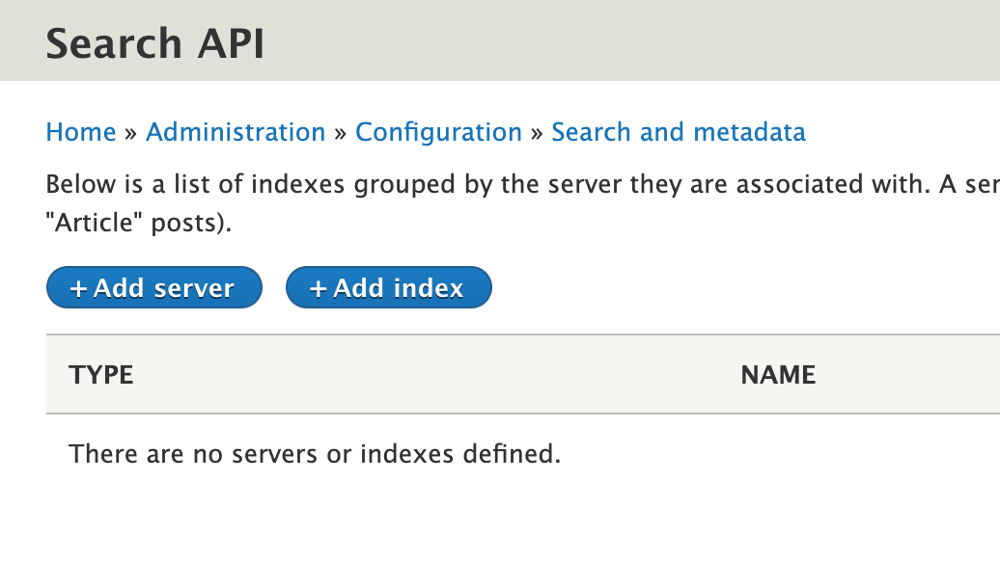
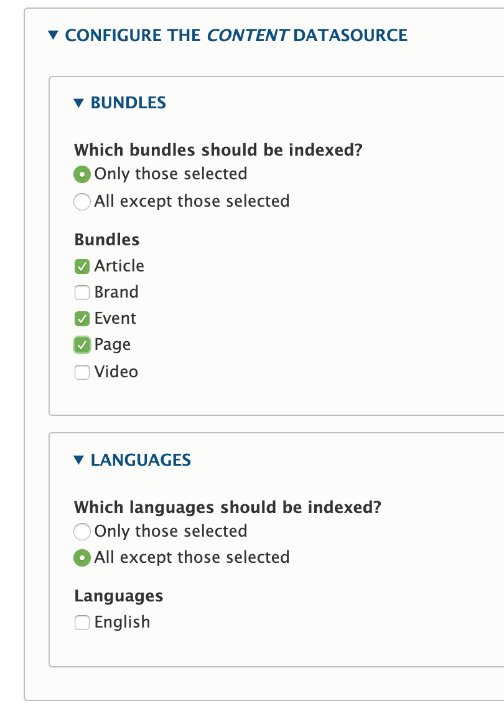
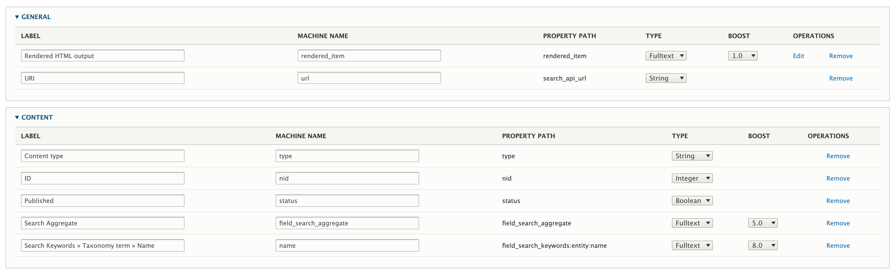
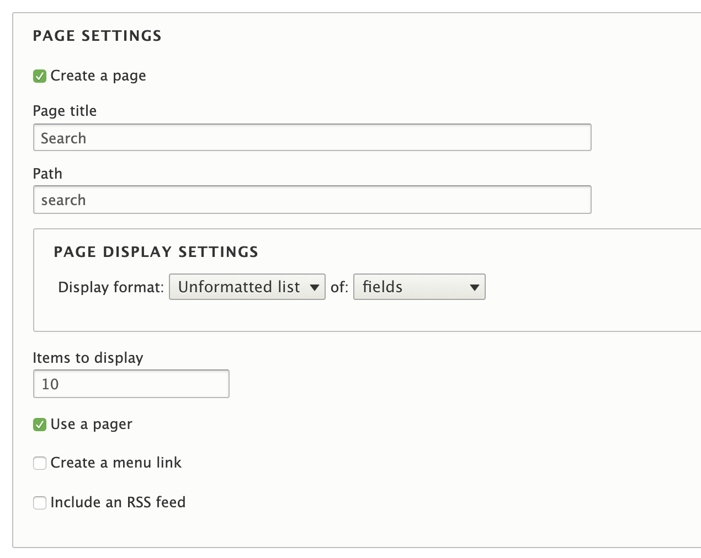

### Grab and enable the Fire Search module

1. https://github.com/skycatchfire/fire-modules/tree/master/fire_search
2. `drush en fire_search`
3. Update `$valid_bundles` array on line 31 of  `fire_search.module` to the content types you want to add the Search aggregate field to

### Create a Search Keywords taxonomy

#### Add new fields to content types you will be indexing

1. Add a Search Aggregate field (Text, (plain, long))
  - Help Text: Automatically populated when saving a node. Used for search.
2. Add a Search Keywords field (Entity reference) that pull from the Search Keywords taxonomy that you added to each content types that you
  - Should be autocomplete
  - Should allow multiple values
  - Reference Type: Search Keywords
  - Check Create referenced entities if they don't already exist
  - Help Text: A comma-separated list of keywords that will make this content appear in search form suggestions.
3. Add a Search Description field (Text (formatted, long))
	- This will be displayed on the search page for each result
	- Help Text: Displayed on the search results page.

#### Enable Database Search and Search API modules

#### Click Add Server button

2. Fill in fields 
3. Save

### Navigate to Search API page

`/admin/config/search/search-api`

#### Click Add Index button

1. 
2. Fill in fields and select datasources you want to index

3. Scroll down and configure the datasources you selected

4. Choose which server the indexes should use

5. Click the Save and add fields button

### Navigate to Fields tab for datasource

1. /admin/config/search/search-api/index/content/fields
2. 
3. Click Add fields
   1. Add the fields that should be indexed
   2. Configure Type
   3. Configure Boost to desired value if applicable

4. Click Save changes

#### Click Processors tab

1. /admin/config/search/search-api/index/content/processors
2. Enable HTML filter and Ignore case processors

3. Scroll down and update Processor settings for HTML filter

4. Update Processor settings for Ignore case

5. Click Save

#### Click View tab

1. Click the Index now button

### Create a view

1. Name it Search
2. In View Settings, choose Index Content 
3. Click the Create a page checkbox and configure 
4. Click Save and edit

#### Once on the Search View page, add fields to display and configure

1. /admin/structure/views/view/search  

   Update Filter/Sort Criteria 

   

   Create templates, output selected fields, style 😃